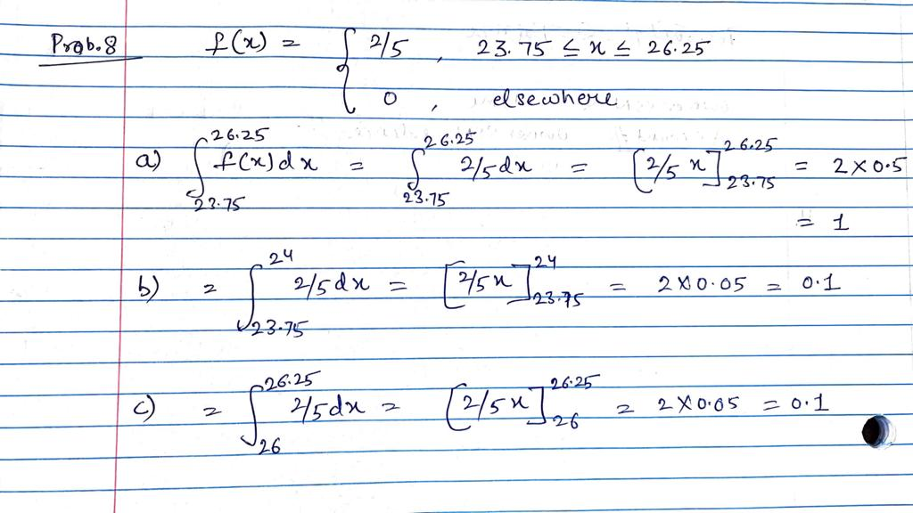

```{r setup, include=FALSE}
knitr::opts_chunk$set(echo = TRUE)
```

## Problem 1 - The following are historical data on staff salaries (dollars per 
## pupil) for 30 schools sampled inthe eastern part of the United States in the 
## early 1970s. 3.79 2.99 2.45 2.14 3.36 2.05 3.14 3.542.77 2.91 3.10 1.84 2.52 
## 3.22 2.67 2.52 2.71 2.75 3.57 3.85 2.89 2.83 3.13 2.44 2.10 3.71 2.372.68 3.51
## 3.37 

## (a)Compute the sample mean and sample standard deviation.(b)Construct a 
## relative frequency histogram of the data.(c)Construct a stem-and-leaf display
## of the data(d)Construct a box plot of the data


> Loading the data

```{R}

p1_data <- c(3.79, 2.99, 2.45, 2.14, 3.36, 2.05, 3.14, 3.54, 2.77, 2.91, 3.10, 
             1.84, 2.52, 3.22, 2.67, 2.52, 2.71, 2.75, 3.57, 3.85, 2.89, 2.83, 
             3.13, 2.44, 2.10, 3.71, 2.37, 2.68, 3.51, 3.37)
```

**(a) Compute the sample mean and sample standard deviation.**


```{R}
p1_mean <- sum(p1_data) / length(p1_data)
p1_mean
```

```{R}
p1_var <- ((p1_data - p1_mean)^2) / (length(p1_data) - 1)
p1_var <- sum(p1_var)
p1_sd <- p1_var^0.5

p1_sd
```

**(b) Construct a relative frequency histogram of the data**


**Method-1 : using package "lattice" function to calculate the Percentage of Total (Relative Frequency).**

```{r}
lattice::histogram(p1_data, xlab='Staff Salaries (dollars per pupil)', breaks=3)
```


> From the graph, it can be observed that the highest frequency values lie in 
the range of 2.5-3.0, while the lowest frequency values lie in the range of 
1.5 - 2.0.

**(c)Construct a stem-and-leaf display of the data**

```{R}
stem(p1_data, scale = .5)
```

**(d)Construct a box plot of the data**

```{R}
boxplot(p1_data)
```

## Problem 2 - A contractor wishes to build 9 houses, each different in design. 
## In how many ways can he place these houses on a street if 6 lots are on one 
## side of the street and 3 lots are on the opposite side?

> Each lot on the street can be filled by a different house. Thus, for 9 houses 
it doesn't matter if the lot is on one side of the street or the other, the 
answer would be 9 * 8 * 7... 1 which is 9!

```{R}
p2_a <- factorial(9)
p2_a
```

## Problem 3 - How many ways are there that no two students will have the same 
## birth date in a class of size 60

> Assuming each student as a "slot" to fill and each day of the year as the 
available birthdate, there will be 365 days in a non leap year. Thus for 60 
students, Choosing unique values would be 365 * 364 * 363 ... 306 
(Using multiplicative rule)

```{R}

answer_p3 <- 1
for (i in 306:365) {
  answer_p3 <- answer_p3 * i
}

answer_p3
```

## Problem 4 From past experience, a stockbroker believes that under present 
## economic conditions a customer will invest in tax-free bonds with a probability
## of 0.6, will invest in mutual funds with a probability of 0.3, and will invest 
## in both tax-free bonds and mutual funds with a probability of 0.15. At this 
## time, find the probability that a customer will invest

## (a) in either tax-free bonds or mutual funds
## (b) in neither tax-free bonds nor mutual funds


**(a) in either tax-free bonds or mutual funds**

> Investing in one investment type over the other is NOT a mutually exclusive 
event, customers can invest in both of them, thus we have to subtract the 
intersection of these events from the probability. Had they been independant 
events, we could have summed up the individual probabilities.

```{R}

prob_tax_free <- 0.6
prob_mutual_funds <- 0.3
prob_both <- 0.15
p4_a <- prob_tax_free + prob_mutual_funds - prob_both
p4_a
```

**(b) in neither tax-free bonds nor mutual funds**

> To calculate the complement of the above, we can subtract it from 1, ie, 
probability of the sample space

```{R}

p4_b <- 1 - p4_a
p4_b
```

## Problem 5 In a poker hand consisting of 5 cards, find the probability of holding
## (a) 3 aces
## (b) 4 hearts and 1 club

**(a) 3 aces**

> For selecting 3 aces out of 5 cards, since there are 4 aces, the ways of 
selecting 3 aces would be <sup>4</sup> C <sub>3 </sub> * <sup>48</sup> C <sub>2</sub>. 
Total ways of selecting 5 cards out of a 52 card deck is <sup> 52 </sup> C <sub>5</sub>

```{R}

# 4 Choose 3  * 48  Choose 2
numerator_p4a <- (factorial(4) / (factorial(3) * factorial(1))) * 
                    (factorial(48) / (factorial(46) * factorial(2)))

denominator_p4a <- (factorial(52) / (factorial(47) * factorial(5)))

answer_p4a <- numerator_p4a / denominator_p4a
answer_p4a
```

**(b) 4 hearts and 1 club**

> For selecting 4 hearts out of 5 cards, since there are 13 cards in a suit, 
the ways of selecting 4 hearts and 1 club would be <sup>13</sup> C <sub>4 </sub> * 
<sup>13</sup> C <sub>1</sub>. Total ways of selecting 5 cards out of a 52 card 
deck is <sup> 52 </sup> C <sub>5</sub>

```{R}
# 14 Choose 3  * 48  Choose 2
numerator_p4b <- (factorial(13) / (factorial(4) * factorial(9))) * 
                    (factorial(13) / (factorial(12) * factorial(1)))

denominator_p4b <- (factorial(52) / (factorial(47) * factorial(5)))

answer_p4b <- numerator_p4b / denominator_p4b
answer_p4b
```

## Problem 6 The probability that a vehicle entering the Luray Caverns has 
## Canadian license plates is 0.12; the probability that it is a camper is 0.28;
## and the probability that it is a camper with Canadian license plates is 0.09. 
## What is the probability that

## (a) a camper entering the Luray Caverns has Canadian license plates?
## (b) a vehicle with Canadian license plates entering Luray Caverns is a camper?
## (c) a vehicle entering the Luray Caverns does not have Canadian plates or is not a camper?


```{R}
# Assigning probability values to variables
# Probability of Canadian license plate - A
p_a <- 0.12
# Probability of camper - B
p_b <- 0.28
# Probability of both (Intersection)
p_a_int_b <- 0.09
```

**(a) a camper entering the Luray Caverns has Canadian license plates?**

```{R}
# Therefore, probability of P(A | B) (Given that a camper entered cavern, 
# What is the probability that he has Canadian license plates)

p6_a <- p_a_int_b / p_b
p6_a
```

**(b) a vehicle with Canadian license plates entering the Luray Caverns is a camper?**

```{R}
# Similarly, P(B | A)


p6_b <- p_a_int_b / p_a
p6_b
```

**(c) a vehicle entering the Luray Caverns does not have Canadian plates or is not a camper?**

```{R}
# Probability that a vehicle does NOT have Canadian plates or is NOT a camper 
# will be 1 - Probability of both ( intersection )

p6_c <- 1 - p_a_int_b
p6_c
```

## Problem 7 A paint-store chain produces and sells latex and semigloss paint. 
## Based on long-range sales, the probability that a customer will purchase latex
## paint is 0.75. Of those that purchase latex paint,60% also purchase rollers. 
## But only 30% of semigloss paint buyers purchase rollers. A randomly selected 
## buyer purchases a roller and a can of paint. What is the probability that the 
## paint is latex?

```{R}
# Probability of customers purchasing latex
p_latex <- 0.75
# Probability of customers purchasing semigloss
p_semigloss <- 1 - p_latex
# Probability of both rollers and latex
p_rollers_latex <- 0.60
# Probability of rollers and semigloss
p_rollers_semigloss <- 0.30

## Using Bayes theorem

p_latex_rollers <- (p_latex * p_rollers_latex) / ((p_latex * p_rollers_latex) + 
                                                    (p_rollers_semigloss * p_semigloss))
p_latex_rollers
```


## Problem 8 A cereal manufacturer is aware that the weight of the product in the 
## box varies slightly from boxto box. In fact, considerable historical data have 
## allowed the determination of the densityfunction that describes the probability 
## structure for the weight (in ounces). Letting X be therandom variable weight, 
## in ounces, the density function can be described as


## (a)Verify that this is a valid density function.
## (b)Determine the probability that the weight is smaller than 24 ounces.
## (c)The company desires that the weight exceeding 26 ounces be an extremely 
## rare occurrence. What is the probability that this rare occurrence does actually occur?





**(a)Verify that this is a valid density function.**

```{R}
# For being a valid density function, 3 conditions must hold.

# 1. f(x) >= 0 for all R (R -> Set of real numbers). Since the value of the function
# is 2/5 for 23.75 <= x <= 26.25 and 0 elsewhere, this condition is satisfied

# 2.  
#   Integrating f(x)dx = 1 This is also true as integrating constant value gives us 1
```

**(b)Determine the probability that the weight is smaller than 24 ounces.**

```{R}
# For calculating probability < 24, range of the values to consider are < 24  
# (23.75 - 24) and 0 elsewhere

# Integrating with limits 23.75 to 24
# Answer is 2 / 5  * ( 24 - 23.75)  + 0 = 0.1
```

**(c)The company desires that the weight exceeding 26 ounces be an extremely rare occurrence.** 
**What is the probability that this rare occurrence does actually occur?**

```{R}
# For calculating probability > 26, range of the values to consider which 
# are > 26 are 26-26.25 and 0 elsewhere

# Integrating with limits 23.75 to 24
# Answer is 2 / 5  * ( 26.25 - 26 )  + 0 = 0.1
```
